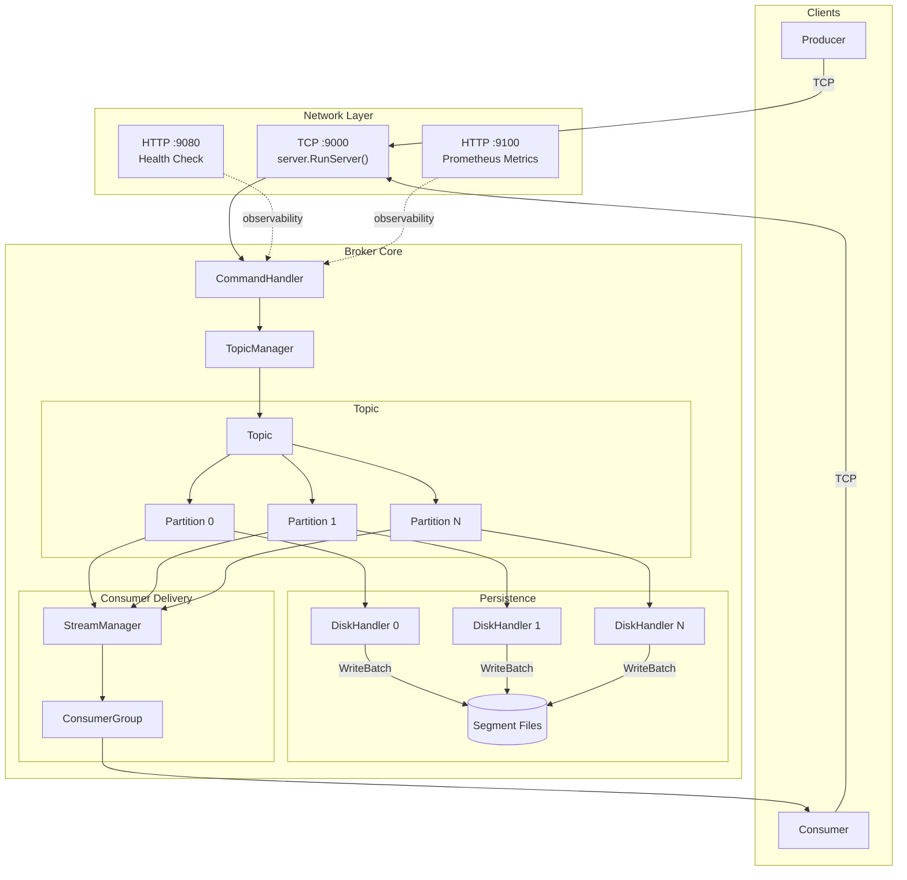
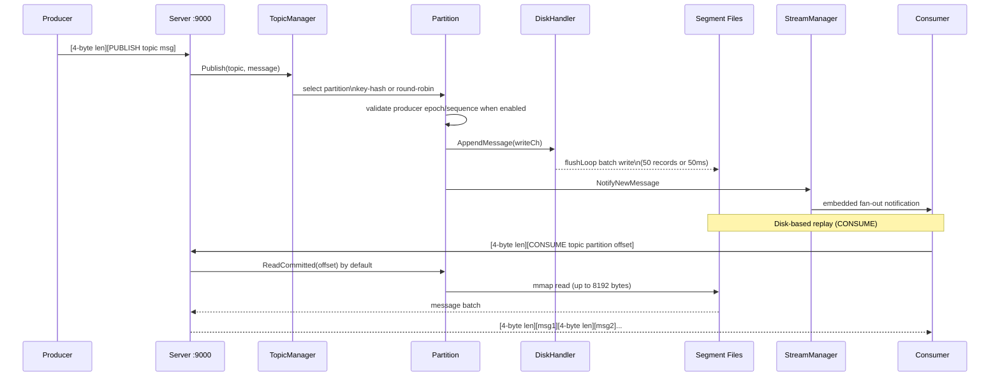
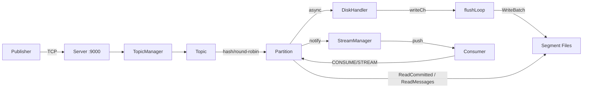
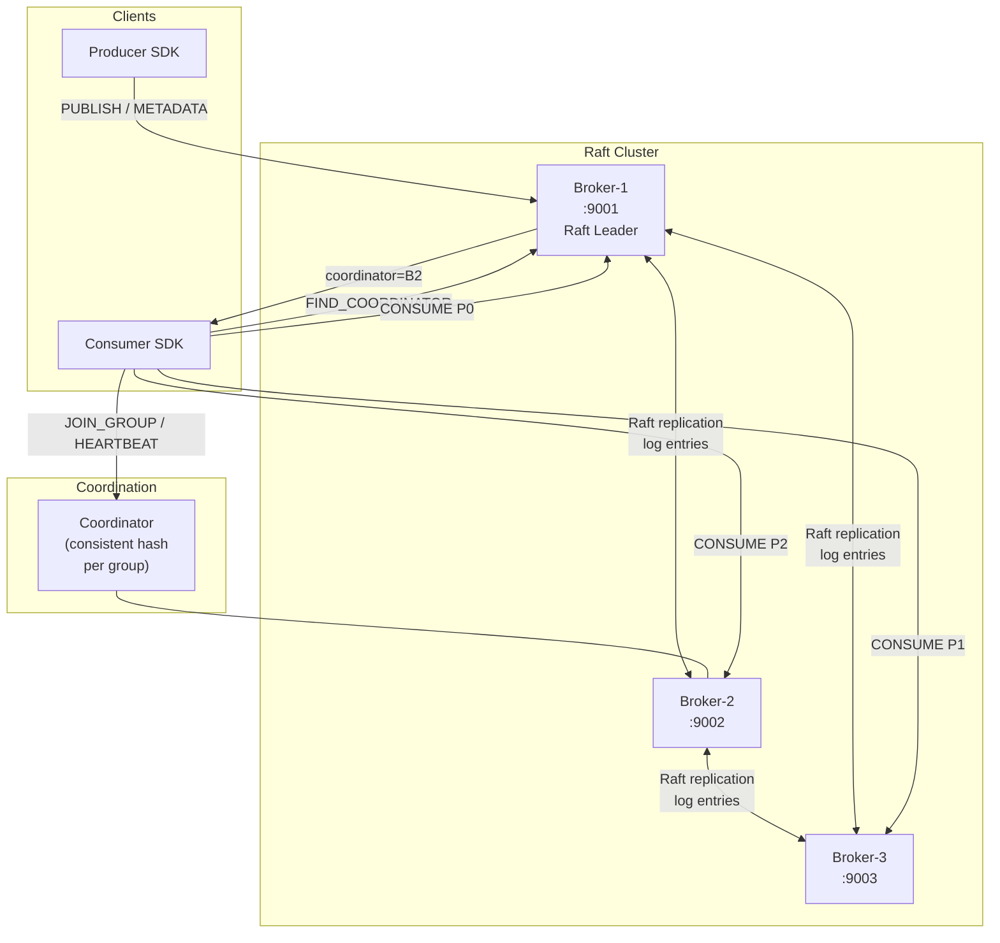
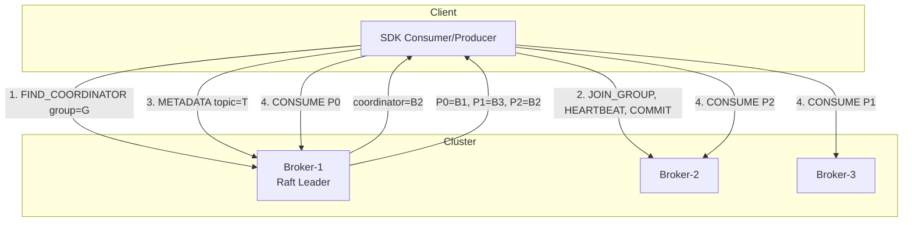
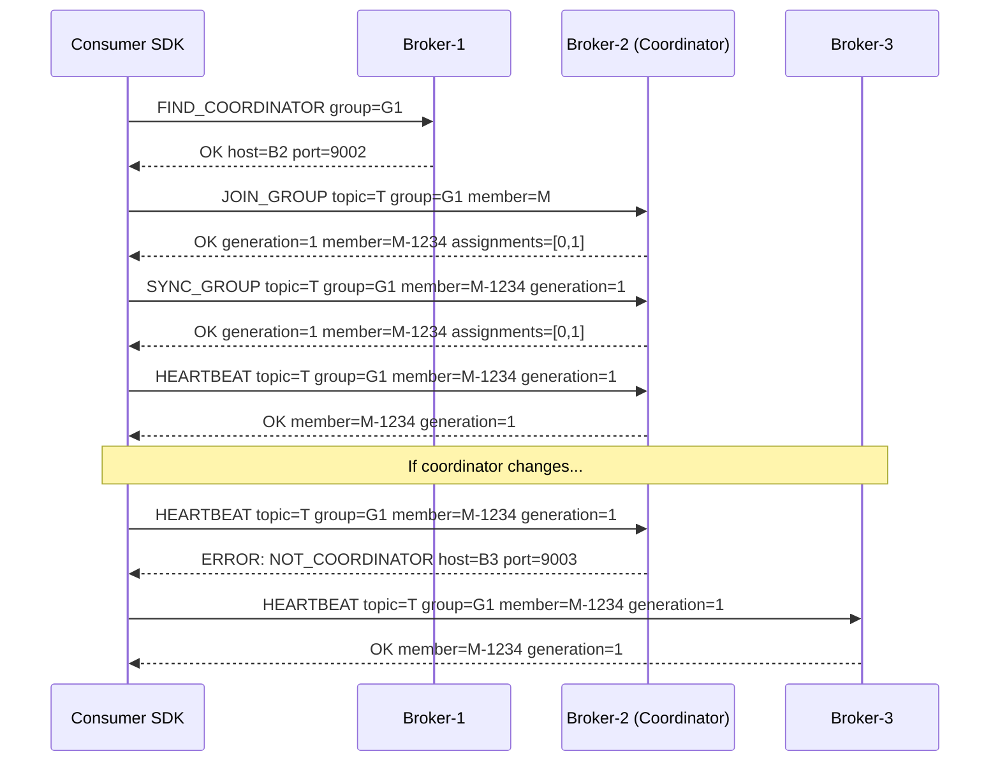
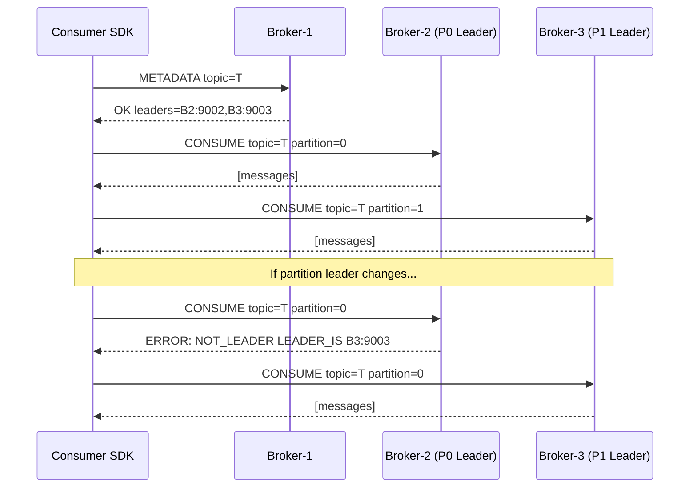
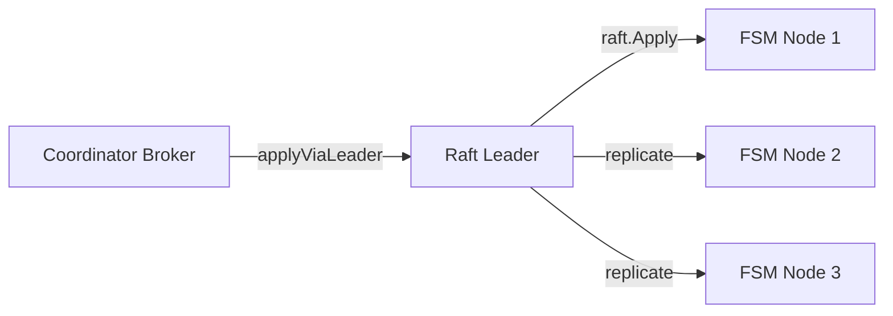

# Architecture Overview

## Purpose and Scope

This document provides a high-level introduction to cursus, a lightweight message broker system.

It covers the system's purpose, core components, and architectural design. For detailed information about specific subsystems, see [Architecture Overview](./contributing/README.md) and [Core Systems](./core/README.md).

For setup instructions, see [Getting Started](./user-guide/README.md).

## System Architecture



## What is cursus?

cursus is a lightweight message broker built around **logically separated but physically distributed data management**.

It provides publish-subscribe messaging with topic partitioning, durable consumer groups, broker transactions, event streams, and disk persistence. The same client protocol runs in standalone mode or in a Raft-backed cluster.

## Key characteristics:

- **Topic-based messaging**: Messages are organized into named topics with configurable partitions
- **Durable persistence**: All messages are persisted to disk using segment-based log files
- **Consumer groups**: Multiple consumer groups can independently consume the same topic
- **Transactions**: Durable transaction coordinator state, producer fencing, partition markers, recovery, and explicit read isolation
- **Cluster ownership**: Raft-backed metadata, group/transaction coordinator routing, partition leaders, and quorum checks
- **Security**: TLS, client authentication/authorization, topic ACLs, and a separate broker-internal command boundary
- **Observable**: Prometheus metrics, health checks, and structured logging


## Network Interfaces

cursus exposes three network ports, each serving a distinct purpose:

| Port | Protocol | Handler | Purpose |
|------|----------|---------|---------|
| 9000 | TCP      | `server.RunServer()` | Main broker operations (`PUBLISH`, `CONSUME`, `CREATE`, etc.) |
| 9080 | HTTP     | `startHealthCheckServer()` | `/live`, `/ready`, and compatible `/health` probes |
| 9100 | HTTP     | `metrics.StartMetricsServer()` | Prometheus exporter with scrape-time broker state |


## Core Data Flow

### End-to-End Data Flow Sequence



### Mermaid Graph Overview



### Key flow characteristics:

- **Retry safety**: idempotent topics validate producer ID, epoch, and sequence per partition; transactions add staged commit/recovery semantics
- **Partition Selection**: `Topic.Publish()` uses key-based hashing for ordered delivery or round-robin counter for load balancing
- **Dual-path delivery**: `Partition.Enqueue()` sends to both disk (via DiskHandler) and consumer channels
- **Asynchronous writes**: DiskHandler batches up to 50 messages or flushes after 50ms linger timeout (configurable)
- **Consumer isolation**: Each ConsumerGroup receives messages independently through dedicated channels

## Message Persistence

Messages are persisted using a segment-based append-only log architecture

Each topic-partition pair gets its own DiskHandler instance:

- Writes asynchronously via `flushLoop()` goroutine
- Batches up to 50 messages or flushes after 50ms linger (configurable)
- Rotates segments at 1GB boundaries (configurable via `log_segment_bytes`)
- Uses `mmap`(memory-mapped I/O) for reads
- Stores messages with 4-byte big-endian length prefixes

This architecture enables parallel I/O across partitions and efficient sequential reads. For detailed persistence mechanics, see [Disk Persistence System](./core/storage/disk-persistence.md).

## Cluster Architecture

cursus supports a configured Raft-based cluster with coordinator and partition-leader routing. The common deployment and test topology uses three brokers so a majority remains available after one node failure; the protocol contract is not hard-coded to exactly three nodes.

### Cluster Topology



### Routing Model



### Connection Types

| Connection | Target | Discovery | Commands |
|---|---|---|---|
| Any broker | Any node | Config | `FIND_COORDINATOR`, `METADATA`, `CREATE`, `LIST` |
| Group coordinator | Per group | `FIND_COORDINATOR group=<group>` | `JOIN_GROUP`, `SYNC_GROUP`, `LEAVE_GROUP`, `HEARTBEAT`, `COMMIT_OFFSET`, `BATCH_COMMIT`, `FETCH_OFFSET` |
| Transaction coordinator | Per logical transaction shard | `FIND_COORDINATOR transactional_id=<id>` | `INIT_PRODUCER_ID`, `BEGIN_TXN`, `TXN_PUBLISH`, `SEND_OFFSETS_TO_TXN`, `END_TXN`, `TXN_STATUS` |
| Partition leader | Per-partition | `METADATA` | `CONSUME`, `STREAM`, `PUBLISH` |

### Transaction Visibility Boundary

With `transactional_processing_v1`, transactional output follows the normal partition-leader publish and replication path when sent, but remains unresolved and invisible to `read_committed`. Commit durably prepares the decision, atomically advances the same group session's multi-topic input offsets, appends a marker to every output partition, and persists the final decision. Transactional IDs map to a stable set of logical coordinator shards (50 by default) whose count, owners, and fencing epochs are stored in Raft metadata. The count is fixed when the cluster is created; a broker configured with a different count is rejected before joining. A new shard owner retries prepared commit or abort work, while the previous owner is rejected by its stale coordinator epoch. Each owner also resolves timed-out transactions for its shards, so recovery work is distributed across active brokers.

This is exactly-once processing inside the Cursus broker boundary for one fenced consumer group session. It does not include external database, HTTP, or filesystem side effects.

### Coordinator Pattern



### Partition Leader Routing



### Raft Consensus

In distributed mode, authoritative group and transaction metadata changes are persisted through the Raft FSM and snapshots. A logical group or transaction coordinator may differ from the Raft leader; `applyViaLeader` forwards the metadata mutation through the authenticated broker-internal path before it is considered durable. Standalone consumer offsets use the internal offset log, while standalone transaction snapshots use an append-only fsynced journal under `log_dir`. The final transaction snapshot is persisted before the in-memory decision opens `read_committed` visibility.



### Advertised Addresses

Each broker registers its client-facing address (`ClientAddr`) in the FSM on startup. This allows any broker to resolve any other broker's external address for `METADATA`, `FIND_COORDINATOR`, and `NOT_LEADER` responses.

```yaml
# Docker Compose example
broker-1:
  environment:
    - ADVERTISED_CLIENT_HOST=localhost
    - ADVERTISED_BROKER_PORT=9001
```
